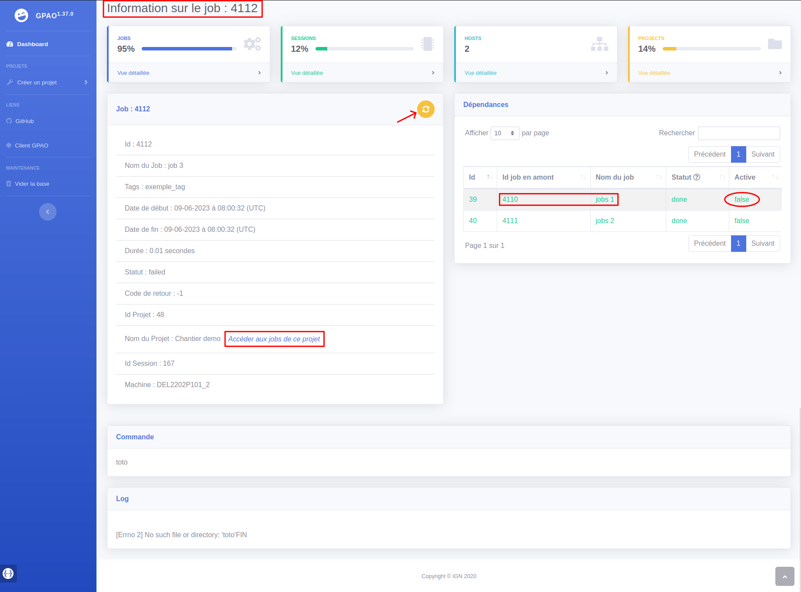
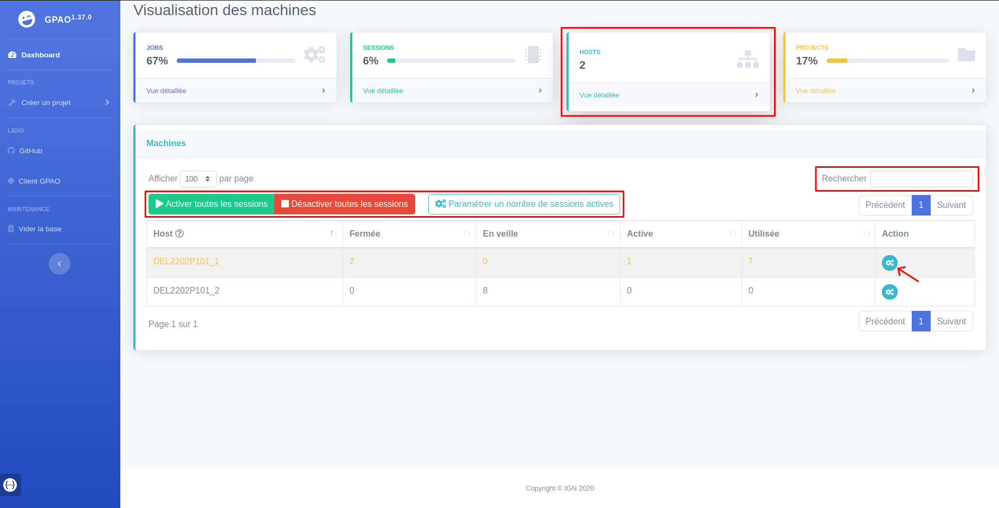
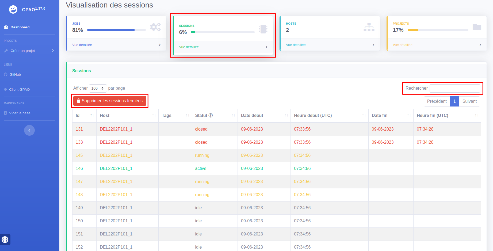

# Documentation utilisateur du Monitor GPAO

## Généralités

Le monitor de la GPAO est une interface Web qui permet le suivi et le pilotage de traitements et des machines les opérants.

Les traitements, appelés **jobs**, sont en fait des commandes `bash` stockées dans une base de données et qui seront exécutées par une machine sur laquelle est installé un ou plusieurs clients GPAO. Chaque client (ou **host** sur l'interface) détecte les jobs à exécuter et les répartit sur plusieurs nœuds de calculs disponibles sur la machine (threads ou **sessions** sur l'interface). Ainsi l'avantage est de paralléliser les jobs en optimisant au mieux les ressources de calcul (threads) de la machine et de gagner du temps de traitement. De plus, on peut travailler avec plusieurs machines pour augmenter les capacités de calcul ou travailler avec des environnements différents (Linux, Windows...).

Les jobs sont organisés par **projet** et un projet est créé et importé dans la base de données via un fichier `JSON` directement interprétable par la GPAO. Ci-dessous un exemple de fichier `JSON`, il contient une liste de projet. Chaque projet est défini par un nom, une liste de jobs et optionnellement une liste de dépendances. Chaque job est défini par un nom, la commande à exécuter et optionnellement une liste de tags et/ou une liste de dépendances.

Les **dépendances** permettent d'imposer une notion de succession entre jobs ou projets :
* Un job sera prêt à être exécuté uniquement si les jobs dont il dépend sont terminés (<span style="color:green">`done`</span>).
* Les jobs d'un projet seront prêts à être exécutés uniquement si tous les jobs des projets dont il dépend sont terminés.
* Par défaut il n'y a aucune dépendance imposée, les jobs peuvent donc tous être traités en parallèle.

Dans l'exemple ci-dessous, le projet_B dépend du projet_A et au sein du projet_A, le job_c dépend de job_a et job_b.

Les **tags** permettent d'assigner un client à un job. Cela peut être utile pour forcer un job à être traité par un client tournant sur une machine Windows ou avec telle ou telle ressource nécessaire à l'exécution dudit job. Pour ce faire, il faut définir des tags identiques (un ou plusieurs) au job et au client concernés. Un job peut être traité uniquement par un client qui possède à minima les tags du job dans sa liste de tags.

Dans l'exemple ci-dessous, le job_a ne pourra être traité que par un client qui possède au moins `tag1,tag2` parmi sa liste de tag. Par défaut aucun tag n'est imposé aux jobs ni aux clients, donc les clients peuvent traiter tous les jobs.

```JSON
{
  "projects": [
    {
      "name": "projet_A",
      "jobs": [
        {
          "name": "job_a",
          "command": "exemple de commande bash",
          "tags": [
            "tag1",
            "tag2"
          ]
        },
        {
          "name": "job_b",
          "command": "exemple de commande bash"
        },
        {
          "name": "job_c",
          "command": "exemple de commande bash",
          "deps": [
            {
              "id": 0
            },
            {
              "id": 1
            }
          ]
        }
      ]
    },
    {
      "name": "projet_B",
      "jobs": [
        {
          "name": "job_x",
          "command": "exemple de commande bash"
        }
      ],
      "deps": [
        {
          "id": 0
        }
      ]
    }
  ]
}
```

## Interface

L'interface de la GPAO s'organise autour des éléments suivants :

* Barre latérale gauche qui indique la version du monitor et permet :
  * l'accès au **Dashboard**
  * l'import de projet via un fichier `JSON` ou `txt` ou encore via une zone de saisie (liste de commande)
  * l'accès aux différents liens de la GPAO
  * de vider toute la base de données de la GPAO !
  * de visualiser l'url de la documentation de l'API de la GPAO en survolant la vignette en bas de la barre latérale
* Menu de 4 "cartes" qui permet d'accéder aux pages de suivi et pilotage des **jobs**/**sessions**/**hosts**/**projets**
* Contenu de la page, ici le Dashboard soit la page d'accueil de la GPAO

Un code couleur relatif au statut des jobs est respecté sur chacune des pages de la GPAO :
* 🔵 <span style="color:blue">`ready`</span> : le job est prêt à être exécuté
* ⚪️ <span style="color:gray">`waiting`</span> : le job est en attente que les jobs dont il dépend soient terminés (<span style="color:green">`done`</span>)
* 🟡 <span style="color:orange">`running`</span> : le job est en cours d'exécution
* 🟢 <span style="color:green">`done`</span> : le job est terminé (avec succès)
* 🔴 <span style="color:red">`failed`</span> : l'exécution du job a échoué

Un clic sur les icônes d'aide <span></span> permet d'afficher un popup détaillant un point précis de l'interface.


## Dashboard

Le **Dashboard** permet le suivi de l'avancement de l'ensemble des projets et des jobs en un coup d’œil.

Les barres de progression et les mini-tableaux associés indiquent pour chaque **projet** :
* Son avancement (parts de jobs <span style="color:green">`done`</span>/<span style="color:red">`failed`</span>/<span style="color:orange">`running`</span>)
* Le détail numérique des jobs selon leur statut dans le mini-tableau. Un warning ⚠ apparaît quand au moins un job a échoué.
* S'il est en train d'être traité. Une roue dynamique apparaît quand au moins un job est en cours de traitement.

Les barres de progression des **jobs** indiquent le nombre tous projets confondus de jobs <span style="color:blue">`ready`</span>/<span style="color:gray">`waiting`</span>/<span style="color:orange">`running`</span>/<span style="color:green">`done`</span>/<span style="color:red">`failed`</span>.


## Jobs

La **page des jobs** permet le suivi de l'ensemble des jobs sous forme de tableau détaillé.

Il est possible d'afficher dans le tableau uniquement les jobs d'un projet précis en *filtrant par projets* dans la liste déroulante.

On peut également filtrer les jobs visibles dans le tableau grâce au *moteur de recherche*. Ce moteur est multicritère et agit sur toutes les cellules du tableau qu'il interprète en chaîne de caractère. Par exemple, en saisissant 'Chantier done' on obtient tous les jobs qui possèdent les chaînes de caractère 'Chantier' et 'done' dans leurs cellules. Attention, les chiffres sont également interprétés en chaîne de caractère, le moteur n'est pas sensible à la casse et l'espace marque un nouveau critère.

Un job en échec peut être réinitialisé individuellement grâce au bouton jaune dans la colonne *Action*. On peut également réinitialiser plusieurs jobs en échec à la fois en cliquant sur le bouton `Réinitialiser les jobs en échecs visibles`. Comme son nom l'indique, il s'applique aux jobs visibles/filtrés sur toutes les pages du tableau.

Dans le tableau, en cliquant sur l'Id ou le Nom d'un job, un lien redirige vers la page détaillée du job. De même, en cliquant sur l'Id ou le Nom d'un projet, un lien redirige vers la page détaillée du projet.


Ci-dessous, la **page détaillée d'un job**.

Elle est composée de 4 blocs d'informations :
- Les **caractéristiques** listées du job (id, nom, tags, etc.).
  - Si le job est en échec, on peut le réinitialiser à partir du bouton jaune en haut à droite du bloc.
  - En cliquant sur `Accéder aux jobs de ce projet` un lien redirige sur la page des jobs filtrés par ce projet.
- Un **tableau des dépendances** du job. Ici le job dépend de 2 autres jobs en amont.
  - Des liens sur les Id et les Noms permettent d'accéder à la vue détaillée de ces jobs.
  - La colonne Active indique l'état de la dépendance entre 2 jobs :
    - `true` : Le job en amont n'est pas <span style="color:green">`done`</span>, donc la dépendance reste activée, le job suivant reste <span style="color:gray">`waiting`</span>.
    - `false` : Le job en amont est <span style="color:green">`done`</span>, donc la dépendance est désactivée, le job suivant peut être traité (si toutes ses autres dépendances le sont       également).
- La **commande** `bash` associée au job.
- Les **logs** générés par cette commande lorsqu'elle a été exécutée.



## Projets

La **page des projets** permet le suivi des projets sous forme de tableau détaillé. On y retrouve notamment le nombre de jobs <span style="color:blue">`ready`</span>/<span style="color:gray">`waiting`</span>/<span style="color:orange">`running`</span>/<span style="color:green">`done`</span>/<span style="color:red">`failed`</span> de chaque projet.

Le statut des jobs influence la *colorisation* des lignes des projets :
* 🔵 Le projet est à l'arrêt avec au moins un job prêt
* ⚪️ Le projet est en attente que ses dépendances à d'autres projets soient désactivées
* 🟡 Au moins un job est en cours d'exécution
* 🟢 Tous les jobs du projet ont été exécutés avec succès
* 🔴 Le projet est terminé avec au moins un échec OU est bloqué par une dépendance à un job en échec

On retrouve ces informations sur la colorisation dans le popup d'aide <span></span>. De plus, un warning ⚠ apparaît si au moins un job du projet a échoué.

Comme sur la page des jobs, un *moteur de recherche* permet de filtrer les projets visibles.

Un projet peut être supprimé individuellement grâce au bouton rouge dans la colonne *Action*.

Une liste déroulante dans la colonne *Priorité* permet de changer la priorité d'un projet (c'est à dire s'il sera traité plus ou moins rapidement par les clients) selon 3 degrés `Low`/`Normal`/`High` (par défaut `Normal`).

Ces deux actions peuvent également être réalisées sur plusieurs projets à la fois en cliquant sur les boutons rouge et bleu `[...] projets visibles`. L'action s'applique sur tous les projets visibles/filtrés de toutes les pages du tableau.


Dans le tableau, en cliquant sur l'Id ou le Nom d'un projet, un lien redirige vers la page détaillée du projet.


Ci-dessous, la **page détaillée d'un projet**.

Elle est composée de 4 blocs d'informations :
- Les **caractéristiques** listées du projet (id, nom, mini-tableau de répartition des jobs, etc.) ainsi que des statistiques propres à ce projet.
- Un **tableau des dépendances** du projet. Ici le projet dépend d'un autre projet en amont.
  - Des liens sur les Id et les Noms permettent d'accéder à la vue détaillée de ce projet.
  - La colonne Active indique l'état de la dépendance entre 2 projets :
    - `true` : Au moins un job du projet en amont n'est pas <span style="color:green">`done`</span>, donc la dépendance reste activée, le projet suivant reste <span style="color:gray">`waiting`</span>.
    - `false` : <u>Tous</u> les jobs du projet en amont sont <span style="color:green">`done`</span>, donc la dépendance est désactivée, le projet suivant peut être traité (si toutes ses autres dépendances le sont également).
- Un **diagramme** de la répartition des jobs du projet en fonction de leur statut.
- Un **tableau des jobs** de ce projet offrant les mêmes fonctionnalités que celui sur la page des jobs.


## Hosts

La **page des hosts** permet le suivi des machines sur lesquelles sont installés les clients GPAO. Le tableau détaillé indique notamment le nombre de sessions (threads) fermées/en veille/actives/utilisées pour chaque machine.

**NB** : une machine peut parfois héberger plusieurs clients GPAO, dans ce cas un suffixe est rajouté au nom de la machine pour les différencier. Ici quand on parle de 'host' ou 'machine', il faut comprendre le client GPAO qui lui est associé avec un nombre de threads (sessions) alloués défini.

Comme sur la page des jobs, un *moteur de recherche* permet de filtrer les machines visibles.

Le bouton bleu dans la colonne *Action* permet de modifier individuellement le nombre de sessions actives d'une machine.

3 boutons s'appliquent sur l'ensemble des machines visibles/filtrées.
* Le vert permet d'activer toutes les sessions des machines visibles.
* Le rouge de toutes les désactiver.
* Le bleu de saisir un nombre de sessions à activer pour toutes les machines visibles. Ce nombre est limité automatiquement par les ressources en CPU de chaque machine.



## Sessions

La **page des sessions** permet le suivi de l'ensemble des sessions toutes machines confondues sous forme de tableau détaillé. Une session correspond à un thread d'une machine et exécute les commandes des jobs.

Comme sur la page des jobs, un *moteur de recherche* permet de filtrer les sessions visibles.

Le bouton rouge `Supprimer les sessions fermées` permet de supprimer les sessions de statut <span style="color:red">`closed`</span> (sessions fermées lorsque le client associé est stoppé).


